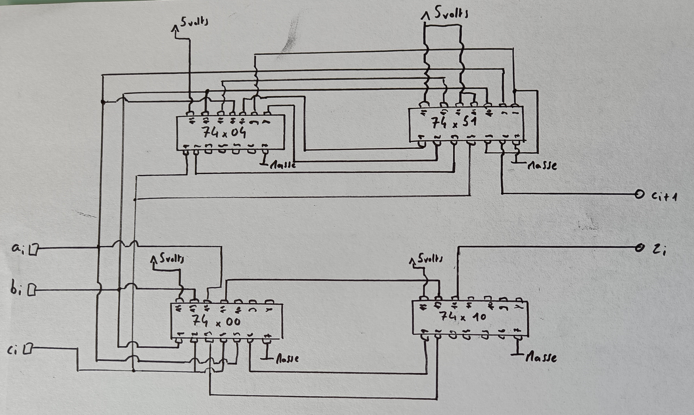
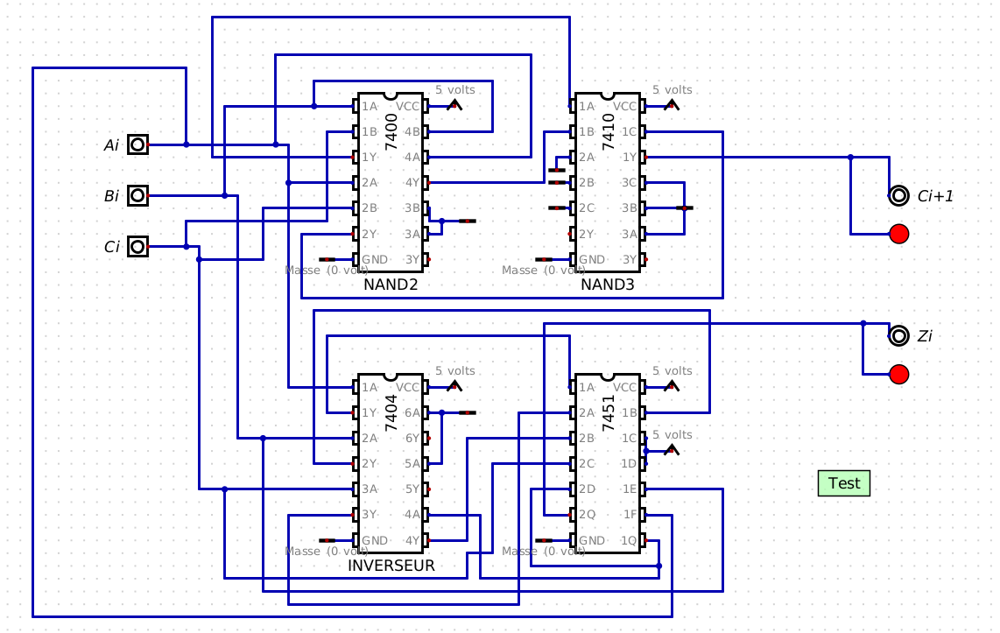
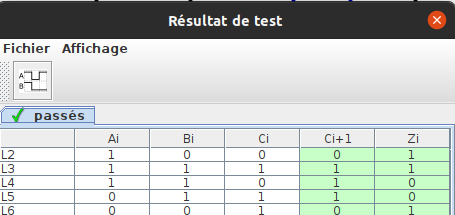
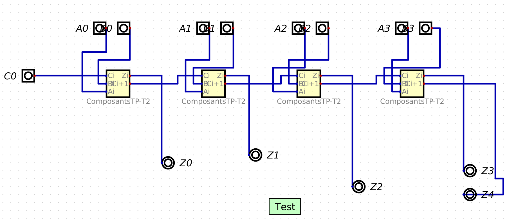
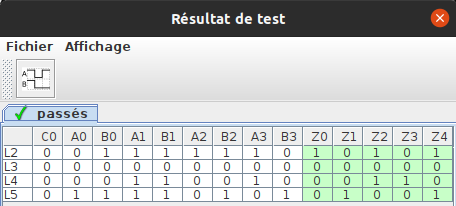
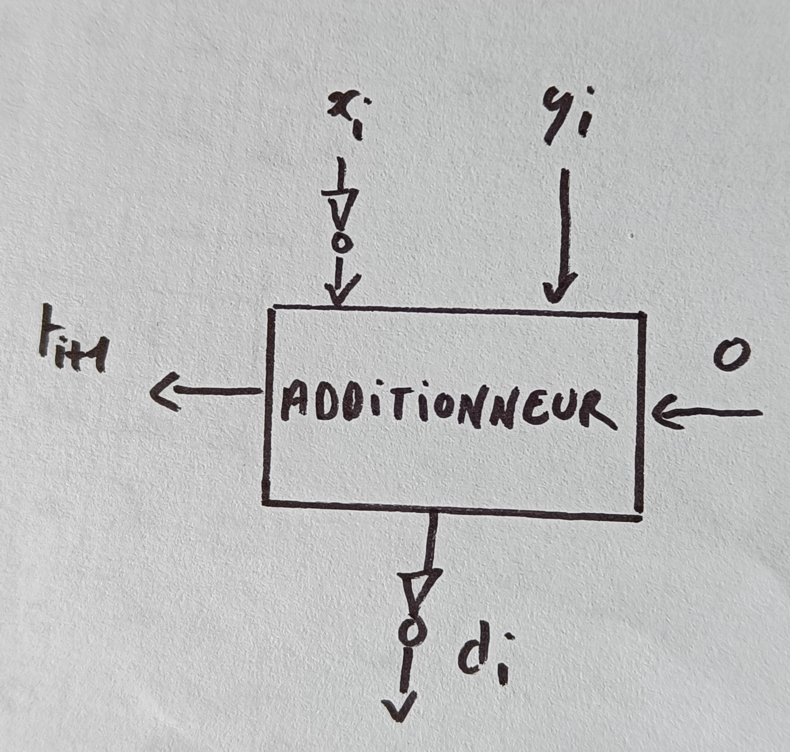
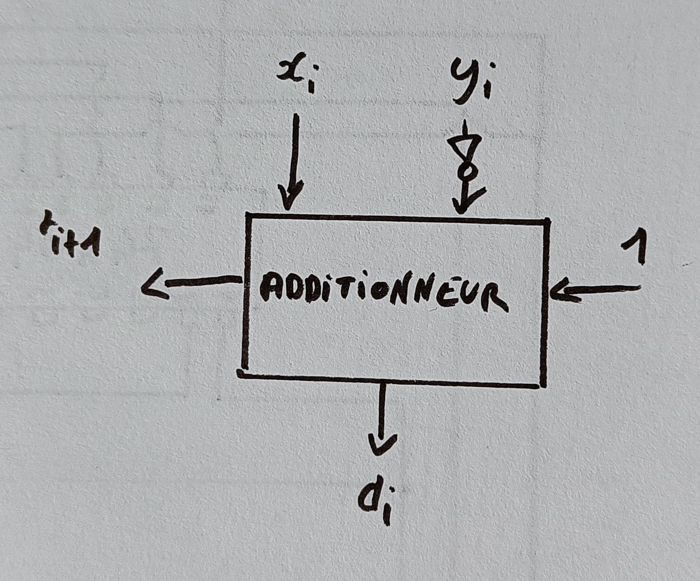

# 2 Etude de l'additioneur binaire

## Q2.1
$\bar x \oplus y = x . y + \bar x . \bar y = \bar x . \bar y + x . y$  
$x \oplus \bar y = \bar x . \bar y + x . y$

Table de vérité du $XOR$ et du $NAND$ :

| x | y | $\otimes$ | $\oplus$ |
|---|---|---------|----------|
| 0 | 0 | 0       | 1        |
| 0 | 1 | 1       | 0        |
| 1 | 0 | 1       | 0        |
| 1 | 1 | 0       | 1        |  

Donc $\bar \otimes = \oplus$ et $\bar \oplus = \otimes$  

$\overline{x \oplus y} = \bar x \otimes \bar y = x . y + \bar x . \bar y = \bar x . \bar y + x . y$  

$\overline{\bar x \oplus \bar y}=x \otimes y$

Enfin, nous pouvons conclure que :

$$x \oplus y = \bar x \oplus y = x \oplus \bar y = \overline{x \oplus y} =\overline{\bar x \oplus \bar y}$$

## Q2.2

1. Le résultat $z_i$

Table de vérité :

| $a_i$ | $b_i$ | $c_i$ | $z_i$ |
|-------|-------|-------|-------|
| 0     | 0     | 0     | 0     |
| 0     | 0     | 1     | 1     |
| 0     | 1     | 0     | 1     |
| 0     | 1     | 1     | 0     |
| 1     | 0     | 0     | 1     |
| 1     | 0     | 1     | 0     |
| 1     | 1     | 0     | 0     |
| 1     | 1     | 1     | 1     |

Nous obtenons donc :
$$z_i = \overline{a_i} . b_i . c_i + a_i . \overline{b_i} . ci + a_i . b_i . \overline{c_i} + a_i . b_i . c_i$$
$$= a_i . (\overline{b_i} . \overline{c_i} + b_i . c_i) + \overline{a_i} . (\overline{b_i} . c_i + b_i . \overline{c_i})$$
$$= a_i . (b_i \otimes c_i) + \overline{a_i} . (b_i \oplus c_i)$$
$$= a_i . (\overline{b_i \oplus c_i}) + \overline{a_i} . (b_i \oplus c_i)$$
$$= a_i \oplus b_i \oplus c_i$$

2. La retenue $c_{i+1}$

Table de vérité :

| $a_i$ | $b_i$ | $c_i$ | $c_{i+1}$ |
|-------|-------|-------|-----------|
| 0     | 0     | 0     | 0         |
| 0     | 0     | 1     | 0         |
| 0     | 1     | 0     | 0         |
| 0     | 1     | 1     | 1         |
| 1     | 0     | 0     | 0         |
| 1     | 0     | 1     | 1         |
| 1     | 1     | 0     | 1         |
| 1     | 1     | 1     | 1         |

Avec un tableau de Karnaugh nous pouvons simplifer la fonction en :
$$c_{i+1} = a_i . b_i + b_i . c_i + a_i . c_i$$

Nous avons :
$$NAND(x,y) = \overline{x.y} = \bar x + \bar y$$

Pour faire apparaître des NAND dans l'expression :
$$c_{i+1} = \overline{\overline{a_i . b_i}} + \overline{\overline{b_i . c_i}} + \overline{\overline{a_i . c_i}}$$
$$= \overline{NAND(a_i, b_i)} + \overline{NAND(b_i, c_i)} + \overline{NAND(a_i, c_i)}$$
$$c_{i+1} = NAND(NAND(a_i, b_i), NAND(b_i, c_i), NAND(a_i, c_i))$$

## Q2.3

Pour obtenir un $x \oplus y$ sachant que nous disposons de $x$, $y$ et d'inverseurs il faut placer:

- Sur l'entrée A : $x$ suivi d'un inverseur
- Sur l'entrée B : $y$ suivi d'un inverseur 
- Sur l'entrée C : $x$
- Sur l'lentrée D : $y$

 Nous obtiendrons $Y = \overline{\bar x . \bar y + x . y} = \overline{x \otimes y} = x \oplus y$

 Pour obtenir $x \otimes y$ il suffit de placer un inverseur à la sortie car nous avons prouvé que $x \otimes y = \overline{x \oplus y}$

\newpage

## Q2.4

Voici notre schéma de câblage de l'additionneur binaire :

{height=300px width=450px}

## Q2.5

Le circuit réalisé sur Digital : 

{height=300px width=450px}

Ainsi que les tests effectués pour s'assurer du bon fonctionnement du schéma :

{height=150px width=450px}

\newpage

## Q2.6

Le circuit de l'additionneur 4 bits :

{height=300px width=450px}

Ainsi que les tests effectués pour s'assurer du bon fonctionnement du schéma :

{height=150px width=450px}

\newpage

# 3 Etude du soustracteur

Voici la table de vérité pour la soustraction binaire :

| $x_i$ | $y_i$ | $t_i$ | $t_{i+1}$ | $d_i$|
|-------|-------|-------|-----------|------|
| 0     | 0     | 0     | 0         | 0    |
| 0     | 0     | 1     | 1         | 1    |
| 0     | 1     | 0     | 1         | 1    |
| 0     | 1     | 1     | 1         | 0    |
| 1     | 0     | 0     | 0         | 1    |
| 1     | 0     | 1     | 0         | 0    |
| 1     | 1     | 0     | 0         | 0    |
| 1     | 1     | 1     | 1         | 1    |

Nous pouvons premièrement remarque que $d_i$ est égal à $z_i$, nous pouvons donc écrire :
$$d_i = x_i \oplus y_i \oplus t_i$$

Pour $t_{i+1}$, à l'aide d'un tableau de Karnaugh nous obtenons :
$$t_{i+1} = \overline{x_i} . t_i + \overline{x_i} . y_i + y_i . t_i$$

Nous pouvons donc l'écrire avec seulement des portes NAND :
$$t_{i+1} = NAND(NAND(\overline{x_i}, t_i), NAND(\overline{x_i}, y_i), NAND(y_i, t_i))$$

Nous remarquons que l'expression de $t_{i+1}$ est proche de celle de $c_{i+1}$, seul $x_i$ est inversé.

## 3.1 Utilisation de l'additionneur pour la réalisation du soustracteur

La première solution, comme dit précédemment, consiste à inverser $x_i$ pour obtenir $t_{i+1} = c_{i+1}$. Cependant, sela aura une conséquence sur le résultat $d_i$. Si nous réalisons le tableau de vérité de $d_i$ en inversant l'entrée $x_i$ nous obtenons :

| $x_i$ | $y_i$ | $t_i$ | $d_i$ | $\overline{x_i}$ | $d_i$ (cas où $x_i = \overline{x_i}$) |
|-------|-------|-------|-------|------------------|---------------------------------------|
| 0     | 0     | 0     | 0     | 1                | 1                                     |
| 0     | 0     | 1     | 1     | 1                | 0                                     |
| 0     | 1     | 0     | 1     | 1                | 0                                     |
| 0     | 1     | 1     | 0     | 1                | 1                                     |
| 1     | 0     | 0     | 1     | 0                | 0                                     |
| 1     | 0     | 1     | 0     | 0                | 1                                     |
| 1     | 1     | 0     | 0     | 0                | 1                                     |
| 1     | 1     | 1     | 1     | 0                | 0                                     |

Nous pouvons observer que $d_i$ (cas où $x_i = \overline{x_i}$) $= \overline{d_i}$. Pour utiliser l'additioneur pour réaliser une soustraction binaire, il nous faut inverser la première opérande $x_i$ ainsi que le résultat $d_i$.

{height=150px width=450px}

\newpage

Pour la deuxième solution, il faut inverser la retenue entrante (qui doit donc commencer à 1 et non à 0) ainsi que la deuxième opérande.

| $x_i$ | $y_i$ | $t_i$ | $d_i$ | $z_i$ | $\overline{t_i}$ | $d_i$ | $z_i$ |
|-------|-------|-------|-------|-------|------------------|-------|-------|
| 0     | 0     | 0     | 0     | 0     | 1                | 1     | 1     |
| 0     | 1     | 0     | 1     | 1     | 1                | 0     | 0     |
| 1     | 0     | 0     | 1     | 1     | 1                | 0     | 0     |
| 1     | 1     | 0     | 0     | 0     | 1                | 1     | 1     |

On remarque que lorsque la retenue entrante est à 1, nous obtenons des valeurs $d_i$ et $z_i$ inverses par rapport aux résultats $d_i$ et $z_i$ lorsque la retenue entrante est à 0. Si maintenant nous inversons $y_i$ :

| $x_i$ | $y_i$ | $t_i$ | $d_i$ | $z_i$ | $\overline{t_i}$ | $d_i$ | $z_i$ |
|-------|-------|-------|-------|-------|------------------|-------|-------|
| 0     | 1     | 0     | 1     | 1     | 1                | 0     | 0     |
| 0     | 0     | 0     | 0     | 0     | 1                | 1     | 1     |
| 1     | 1     | 0     | 0     | 0     | 1                | 1     | 1     |
| 1     | 0     | 0     | 1     | 1     | 1                | 0     | 0     |

Nous pouvons voir qu'après avoir inversé $y_i$ et en ayant la retenue entrante à 1, nous obtenons les mêmes valeurs que lorsque $y_i$ n'est pas inversé et que la retenue entrante est à 0.

{height=150px width=450px}

Pour conclure, en terme de nombre de portes logiques, la deuxième solution s'avère être meilleure car seul un inverseur est utilisé contre 2 dans la première solution.