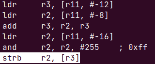
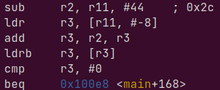
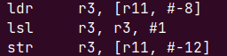

## Q1

Pour trouver tous les nombres premiers jusqu'à N non compris, le programme parcours les entiers en partant de 2 et élimine en mettant 0 les multiples du nombre courant. Au fur et à mesure, il ne restera plus que des nombres premiers.

## Q2

`$@` Représente le nom de la cible et `$<` représente le premier pré-requis 

## Q3

La pile commence à l'adresse 0x12000, nous pouvons le voir grâce à la commande `x/ $sp` qui nous montre l'adresse vers laquelle pointe le registre `sp`.	

## Q4

 
## Q5

La valeur en hexadécimal de fp est : `0x11ffc`  
La valeur en hexadécimal de sp est : `0x11fd0`

## Q6

La variable i est stockée dans le registre `r3`, j est stockée dans le registre 

**à faire**

## Q7

**à faire**

## Q8

sub     r3, r11, #44    ; 0x2c
ldr     r3, [r11, #-8] 

## Q9

Les paramètres sont passés dans les registres `r0`, `r1` et `r2`. Nous avons `r0` qui est un pointeur sur le tableau qui vaut `0x11fd0`, `r1` (j) vaut 4 et `r2` vaut 0.

## Q10

L'instruction `push {fp, lr}` empile LR puis FP dans la pile les registres fp et lr.

## Q12

Les paramètres de la fonctions sont stockés dans la pile. Le premier paramètre `r0` est stocké à l'adresse 0x11fc4 (fp=0x11fcc) (fp-8), `r1` est emplié à l'adresse 0x11fc0 (fp-12) et `r2` se situe à l'adresse 0x11fbc (fp-16)

## Q13

L'affectation `*(tab+i)=val` se traduit comme ceci :

Nous chargeons dans r3 la valeur de i (soit 4) puis l'adresse du tableau dans r2 (0x11fd0). Nous additions ensuite ces deux valeurs pour savoir où enregistrer `val` que nous mettons dans r3. Enfin, nous stockons à l'adresse stockée dans r3 la valeur (1 seul octet) de val que nous avonc récupéré dans r2.

## Q14
L'adresse de la case du tableau modifiée est 0x11fd4 et sa valeur est 0x01010101.

Nous utilisons strb pour ne stocker qu'une octet puisque nous enregistrons la valeur dans un tableau de charactères. L'intérêt de l'instruction `r2, r2, #255` est de récupérer qu'un seul octet. Nous appliquons un masque de 8 bits (0xFF) pour ne garder que les 8 premiers bits de val.

## Q15
Les trois dernières instructions permettent de libérer r11 de la pile. On enregistrre la valeur de r11 dans sp puis nous dépilons r11.
Le registre lr vaut 0x100cc à ce moment là. L'instruction située à cette valeur est `ldr r2, [r11, #-12]`.

## Q16

La traduction de l'instruction `if(tab[i])` est :

La deuxième nous permet de récupérer l'adresse de l'élément suivant le `#-8` désigne un décalage de 8 bits, donc d'un octet, la taille d'un `char`.
L'instruction `ldrb r3, [r3]` nous permet de récupérer la valeur de l'élément que nous voulons tester. Ensuite les deux lignes suivantes permettent de le comparer à 0, l'objectif du `if(tab[i])` de base.

## Q17

La valeur des 4 octets codant l'instruction `beq .L4` est : `0x0a00000f`. La valeur de cond est 0 et celle de déplacement est f soit 15 en décimal.

## Q18

La traduction de l'instruction `j=i*2` est :

Nous récupérons la valeur de `i` de la pile via la première instruction. Ensuite nous effectuons un décalage à droite, ce qui nous permet de mutliplier par 2 la valeur grâce à la notation en base 2 ($2^0 + 2^1 + 2^2 + ...$). Nous stockons ensuite cette nouvelle valeur dans la pile.

