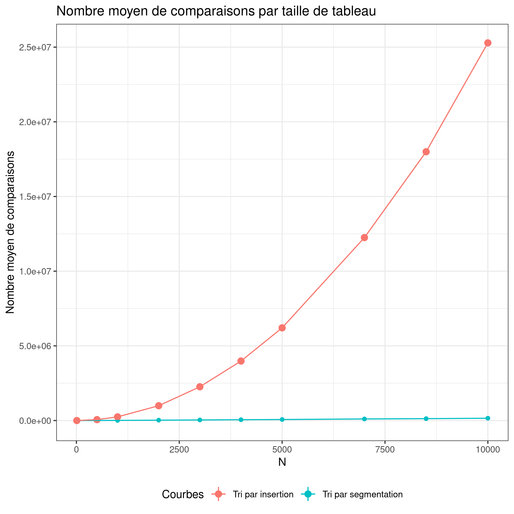

# Introduction

Lors de ce TP, nous avons du instrumenter des algorithmes de tri pour réaliser et analyser des mesures. L'objectif de ce TP était de mesurer et vérifier la complexité de deux algorithmes de tri, le tri par insertion et le tri par segmentation. Les mesures de complexités ont été mesurées sur ces deux algorithmes en observant le nombre de comparaisons des éléments du tableau venant à être trié.

# Mise en place des expériences

Nous avons mesuré le nombre de comparaisons d'éléments du tableau de taille N pour chaque algorithme de tri. Pour cela nous avons effectué 10 mesures avec des tailles `N` de tableau différents (allant de 10 à 10000). Pour chaque valeur de `N`, nous effectuons 10000 fois le tri avec des valeurs différentes pour récupérer au final la moyenne `f` de comparaisons.  
Nous avons choisi de telles valeurs de N avant que l'on puisse voir l'efficacité des tris en fonction de toutes les tailles possibles mais nous avons été limités à 10 000 à cause du long temps d'exécution du tri par insertion.

# Présentation des résultats

Après avoir regardé le graphique ci-dessous, nous pouvons en déduire de ces courbes que le tri par segmentation (ici en rouge) effectue bien moins de comparaions que le tri par insertion (courbe bleu). Pour un tableau de taille N = 10000 en entrée, on observe que le tri par segmentation effectue près de 130 fois moins de comparaions que le tri par insertion. De plus, ce dernier possède une courbe exponentielle qui ne cèsse de croître avec l'augmentation du tableau d'entrée, contrairement au tri par segmentation qui possède une évolution plus lente et régulière. Nous pouvons corréler ces résultats avec les complexités théoriques de ces algortihmes. Nous remarquons bien que le tri par segmentation, possèdant une complexité de $\mathcal{O}(n\log{}n)$ avec des valeurs moins élevées que le tri par insertion avec une complexité de $\mathcal{O}(n^2)$ et des valeurs bien plus élevées.  

Voici les courbes obtenues :  

# Conclusion

Nous avons pu tester deux sortes de tris et voir que chacuns a des avantages et des inconveniants. Par exemple le tri par insertion est facile à implementer et reste efficace pour des petits tableaux mais son utilisation est vite limitée pour de grands tableaux de valeurs à cause de sa complexité constante $\mathcal{O}(n^2)$.  
A l'opposé, le tri par segmentation est plus compliqué à implementer dans le code mais celui-ci est très rapide pour la plupart des tableaux grâce à sa moyenne de complexité de $\mathcal{O}(n\log{}n)$