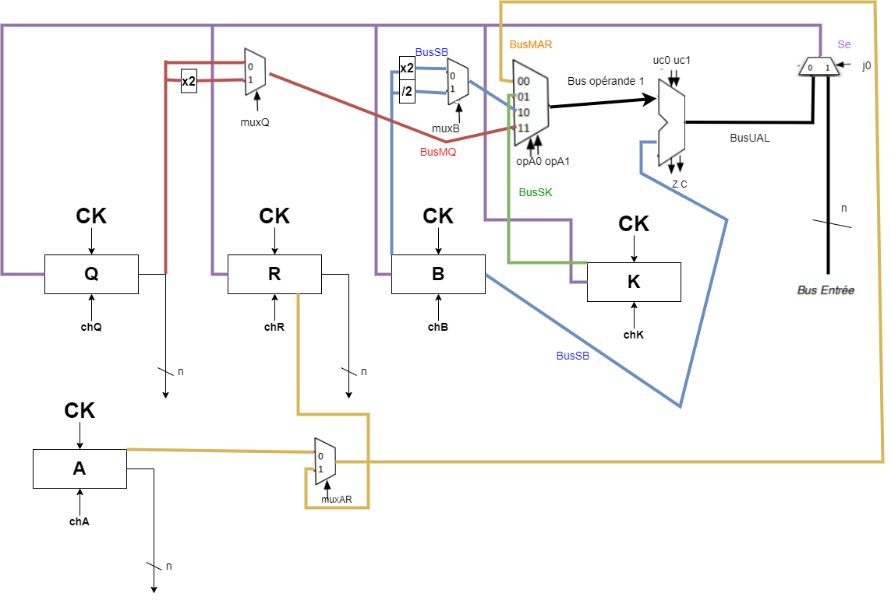
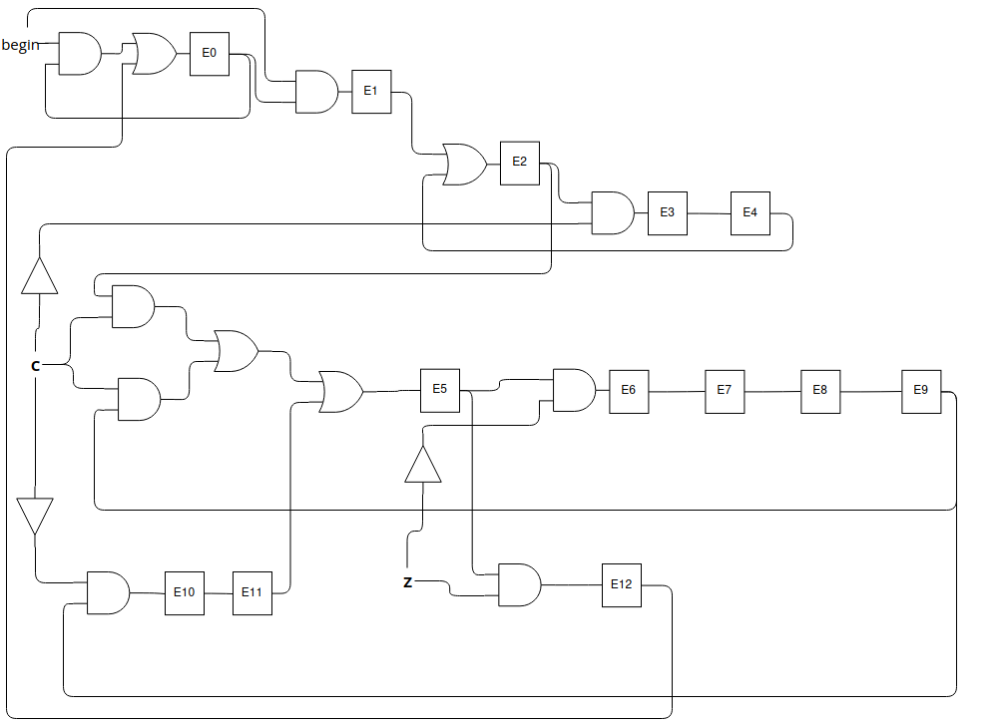

# 3 - Le circuit
## 3.3 - La partie opérative

### 2. Schéma de la partie opérative

{height=300px}

### 3. Codage des commandes de l'UAL

L'UAL nous permet de faire quatre opérations à savoir la soustraction, la décrémentation, l'incrémentation et une opération neutre qui permet de rendre le nombre A comme résultat. Nous pouvons coder uc0 et uc1 comme ceci :

| uc1 | uc0 | opération   |
|-----|-----|-------------|
| 0   | 0   | $A - B$     |
| 0   | 1   | $A - 1$     |
| 1   | 0   | $A + 1$     |
| 1   | 1   | $A$         |

\newpage

### 4. Réprésentation d'une registre à n bits

```
node registren <<const n : int>> (ent : bool^n; char: bool)
returns (sort : bool^n)
let
	sort = map<<bascule;n>>(ent,char^n,false^n,false^n);
tel;
```

## 3.4 - La partie contrôle

### 1. Automate

Voici le graphe de l'automate de contrôle de la PO.
Nous avons traduit l'algorithme donné dans le sujet en associant à chaque état une opération de l'algorithme (affectation ou test).
De plus, les flags C et Z sont mis à jour pour les 3 comparaisons où 

{height=300px}

### 2. Valeurs de sorties

Nous pouvons résumer les valeurs que doivent prendre les entrées à chaque état de cet automate :

| Etat | chQ | chR | chA | chB | chK | muxAR | muxB | muxQ | opA0 | opA1 | uc0 | uc1 | j0 |
|------|-----|-----|-----|-----|-----|-------|------|------|------|------|-----|-----|----|
| E1   | 1   | 1   | 1   | 0   | 1   | 0     | 0    | 0    | 0    | 0    | 1   | 1   | 1  |
| E2   | 0   | 0   | 1   | 1   | 0   | 0     | 0    | 0    | 0    | 0    | 0   | 0   | 0  |
| E3   | 0   | 0   | 0   | 1   | 0   | 0     | 0    | 0    | 1    | 0    | 1   | 1   | 0  |
| E4   | 0   | 0   | 0   | 0   | 1   | 0     | 0    | 0    | 0    | 1    | 1   | 0   | 0  |
| E5   | 0   | 0   | 0   | 0   | 1   | 0     | 0    | 0    | 0    | 1    | 1   | 1   | 0  |
| E6   | 0   | 0   | 0   | 0   | 1   | 0     | 0    | 0    | 0    | 1    | 0   | 1   | 0  |
| E7   | 0   | 0   | 0   | 1   | 0   | 0     | 1    | 0    | 1    | 0    | 1   | 1   | 0  |
| E8   | 1   | 0   | 0   | 0   | 0   | 0     | 0    | 1    | 1    | 1    | 1   | 1   | 0  |
| E9   | 0   | 1   | 0   | 1   | 0   | 1     | 0    | 0    | 0    | 0    | 0   | 0   | 0  |
| E10  | 0   | 1   | 0   | 1   | 0   | 1     | 0    | 0    | 0    | 0    | 0   | 0   | 0  |
| E11  | 1   | 0   | 0   | 0   | 0   | 0     | 0    | 0    | 1    | 1    | 1   | 0   | 0  |

- muxAR étant la valeur du bit de contrôle du multiplexeur 2 vers 1 qui a soit A soit R comme sortie
- muxB étant la valeur du bit de contrôle du multiplexeur 2 vers 1 qui a soit $B * 2$ soit $B / 2$ comme sortie
- muxQ étant la valeur du bit de contrôle du multiplexeur 2 vers 1 qui a soit Q soit $Q * 2$ comme sortie

Nous avons donc :

- chQ = $E1 + E8 + E11$
- chR = $E1 + E9 + E10$
- chA = $E1 + E2$
- chB = $E2 + E3 + E7 + E9 + E10$
- chK = $E1 + E4 + E5 + E6$
- muxAR = $E9 + E10$
- muxB = $E7$
- muxQ = $E8$
- opA0 = $E3 + E7 + E8 + E11$
- opA1 = $E4 + E5 + E6 + E8 + E11$
- uc0 = $E1 + E3 + E4 + E5 + E7 + E8 + E11$
- uc1 = $E1 + E3 + E5 + E6 + E7 + E8$
- j0 = $E1$

### 3. Circuit de la partie contrôle

Valeur des états à l'étape suivante notés NE :

- NE0 = $\overline{begin} . E0 + E12$
- NE1 = $begin . E0$
- NE2 = $E1 + E4$
- NE3 = $E2 . \bar C$
- NE4 = $E3$
- NE5 = $(E2 . C) + (E9 . C) + E11$
- NE6 = $E5 . \bar Z$
- NE7 = $E6$
- NE8 = $E7$
- NE9 = $E8$
- NE10 = $E9 . \bar C$
- NE11 = $E10$
- NE12 = $E5 . Z$


{height=300px}


