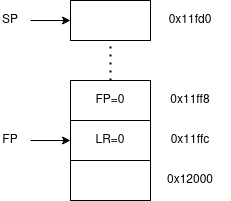
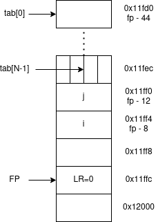
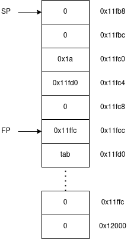
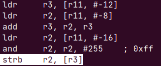
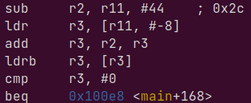
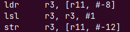

## Q1

Pour trouver tous les nombres premiers jusqu'à N non compris, le programme parcourt les entiers en partant de 2 et élimine en mettant 0 les multiples du nombre courant. Au fur et à mesure, il ne restera plus que des nombres premiers.

## Q2

`$@` Représente le nom de la cible et `$<` représente le premier pré-requis.

## Q3

La pile commence à l'adresse `0x12000`, nous pouvons le voir grâce à la commande `x/ $sp` qui nous montre l'adresse vers laquelle pointe le registre `sp`.	

## Q4

Etat de la pile après la troisième instruction :

{ height=256px }
 
## Q5

La valeur en hexadécimal de fp est : `0x11ffc`.
La valeur en hexadécimal de sp est : `0x11fd0`.

## Q6

Les trois variables i, j et tab sont stockées dans la pile. L'adresse de `i` est `0x11ff4`, l'adresse de `j` est `0x11ff0` et le tableau `tab` est stocké à l'adresse `0x11fd0`.

## Q7

L'adresse de `tab[N-1]` se situe à l'adresse 0x11fed.

{ height=256px }

## Q8

Avec les instructions `mov r3, #0` et `str r3, [r11, #-8]` nous initialisons `i` à `0` et le stockons dans la pile. Ensuite nous comparons `i` à `29` (`cmp r3, #29`) qui est la condition d'arrêt de la boucle. Enfin, après avoir effectué les instructions qui sont dans la boucle, nous incrémentons `i` de `1` (`add r3, r3, #1)`, le stockons dans la pile (`str r3, [r11, #-8]`) et la boucle recommence. La première étiquette que nous rencontrons nous amène à la fin de la boucle où l'on test si `i < N`. Si la condition est juste, une autre etiquette nous envoie au dessus pour mettre en place les paramètres de la fonction `affecttab`. L'etiquette `bl 0x10000 <affecttab>` nous branche à la fonction affecttab.

## Q9

Les paramètres sont passés dans les registres `r0`, `r1` et `r2`. Nous avons `r0` qui est un pointeur sur le tableau `tab` qui vaut `0x11fd0`, `r1` (`j`) vaut `4` et `r2` vaut 0.

## Q10

L'instruction `push {fp, lr}` empile les registres LR puis FP dans la pile.
\newpage

## Q11

Etat de la pile une fois dans la fonction affecttab (après l'instruction `sub sp, sp, #20`):

{height=256px}

## Q12

Les paramètres de la fonction sont stockés dans la pile. Le premier paramètre `r0` est stocké à l'adresse `0x11fc4` (`fp=0x11fcc`) (`fp-8`), `r1` est emplié à l'adresse `0x11fc0` (`fp-12`) et `r2` se situe à l'adresse `0x11fbc` (`fp-16`)

## Q13

L'affectation `*(tab+i)=val` se traduit comme ceci :

Nous chargeons dans `r3` la valeur de `i` (soit 4) puis l'adresse du tableau dans `r2` (`0x11fd0`). Nous additionnons ensuite ces deux valeurs pour savoir où enregistrer `val` que nous mettons dans `r3`. Enfin, nous stockons à l'adresse stockée dans `r3` la valeur (1 seul octet) de val que nous avons récupéré dans `r2`.

## Q14

L'adresse de la case du tableau modifiée est `0x11fd4` et sa valeur est 0.

Nous utilisons strb pour ne stocker qu'une octet puisque nous enregistrons la valeur dans un tableau de charactères. L'intérêt de l'instruction `r2, r2, #255` est de récupérer qu'un seul octet. Nous appliquons un masque de 8 bits (`0xFF`) pour ne garder que les 8 premiers bits de val.

## Q15
Les trois dernières instructions permettent de libérer `r11` de la pile. On enregistrre la valeur de `r11` dans `SP` puis nous dépilons `r11`.
Le registre `LR` vaut `0x100cc` à ce moment là. L'instruction située à cette valeur est `ldr r2, [r11, #-12]`.

## Q16

La traduction de l'instruction `if(tab[i])` est :

La deuxième instruction nous permet de récupérer l'adresse de l'élément suivant le `#-8` désigne un décalage de 8 bits, donc d'un octet, la taille d'un `char`.
L'instruction `ldrb r3, [r3]` nous permet de récupérer la valeur de l'élément que nous voulons tester. Ensuite les deux lignes suivantes permettent de le comparer à 0, l'objectif du `if(tab[i])` de base.

## Q17

La valeur des 4 octets codant l'instruction `beq .L4` est : `0x0a00000f`. La valeur de cond est 0 et celle de déplacement est f soit 15 en décimal.

## Q18

La traduction de l'instruction `j=i*2` est :

Nous récupérons la valeur de `i` de la pile via la première instruction. Ensuite nous effectuons un décalage à droite, ce qui nous permet de mutliplier par 2 la valeur grâce à la notation en base 2 ($2^0 + 2^1 + 2^2 + ...$). Nous stockons ensuite cette nouvelle valeur dans la pile.

## Q19

Voici un tableau résumant les valeurs stockées dans le tableau tab :

| Nombre | Adresse | Valeur  |
|--------|---------|---------|
|      0 | 0x11fd3 |       1 |
|      1 | 0x11fd2 |       1 |
|      2 | 0x11fd1 |       1 |
|      3 | 0x11fd0 |       1 |
|      4 | 0x11fd7 |       0 |
|      5 | 0x11fd6 |       1 |
|      6 | 0x11fd5 |       0 |
|      7 | 0x11fd4 |       1 |
|      8 | 0x11fdb |       0 |
|      9 | 0x11fda |       0 |
|     10 | 0x11fd9 |       0 |
|     11 | 0x11fd8 |       1 |
|     12 | 0x11fdf |       0 |
|     13 | 0x11fde |       1 |
|     14 | 0x11fdd |       0 |
|     15 | 0x11fdc |       0 |
|     16 | 0x11fe3 |       0 |
|     17 | 0x11fe2 |       1 |
|     18 | 0x11fe1 |       0 |
|     19 | 0x11fe0 |       1 |
|     20 | 0x11fe7 |       0 |
|     21 | 0x11fe6 |       0 |
|     22 | 0x11fe5 |       0 |
|     23 | 0x11fe4 |       1 |
|     24 | 0x11feb |       0 |
|     25 | 0x11fea |       0 |
|     26 | 0x11fe9 |       0 |
|     27 | 0x11fe8 |       0 |
|     28 | 0x11fef |       0 |
|     29 | 0x11fee |       1 |

Nous pouvons donc en conclures que 2, 3, 5, 7, 11, 13, 17, 19, 23 et 29 sont des nombres premiers.

## Q20

Une fois le retour de la fonction main effectué, la valeur de `PC` sera 0. Dans le cas où le programme est lancé sur le processeur de nos machines, `PC` contiendrait l'adresse de ce qui a executé le programme actuel.