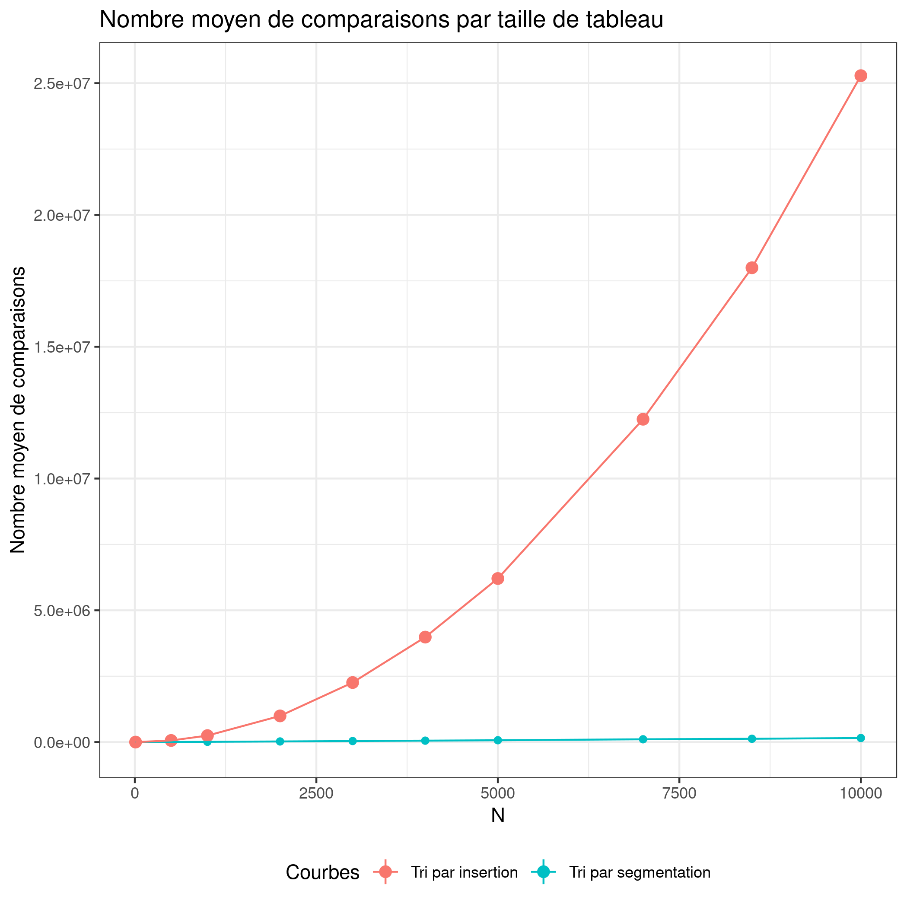

# Présentation et Objectifs du TP

Les objectifs du TP sont:

1. instrumenter des algorithmes

2. réaliser des mesures

3. analyser les mesures

4. comparer les résultats expérimentaux avec les complexités théoriques

# Introduction

Lors de ce TP, nous avons du instrumenter des algorithmes de tri pour réaliser et analyser des mesures. L'objectif de ce TP était de mesurer et vérifier la compléxité de deux algorithmes de tri, le tri par insertion et le tri par ségmentation. Les mesures de compléxités ont été mesurées sur ces deux algorithmes en observant le nombre de comparaisons des éléments du tableau venant à être trié.

# Mise en place des expériences

Nous avons mesuré le nombre de comparaisons d'éléments du tableau de taille N pour chaque algorithme de tri. Pour cela nous avons effectué 10 mesures avec des tailles `N` de tableau différents (allant de 100 à 10000). Pour chaque valeur de `N`, nous effectuons 10000 fois le tri avec des valeurs différentes pour récupérer au final la moyenne `f` de comparaisons.

# Présentation des résultats

Voici les courbes obtenues :  

Nous pouvons en déduire de ces courbes que le tri par ségmentation (ici en rouge) effectue bien moins de comparaions que le tri par insertion (courbe bleu). Pour un tableau de taille N = 10000 en entrée, on observe que le tri par ségmentation effectue près de 130 fois moins de comparaions que le tri par insertion. De plus, ce dernier possède une courbe exponentielle qui ne cèsse de croître avec l'augmentation du tableau d'entrée, contrairement au tri par segmentation qui possède une évolution plus lente et régulière. Nous pouvons corréler ces résultats avec les compléxités théoriques de ces algortihme. Nous remarquons bien que le tri par ségmentation, possèdant une complexité de $\mathcal{O}(n\log{}n)$ avec des valeurs moins élevées que le tri par insertion avec une complexité de $\mathcal{O}(n^2)$ et des valeurs bien plus élevées.

# Conclusion

C'était le meilleur TP de l'année, on hésite à redoubler juste pour pouvoir le refaire l'année prochaine ...

