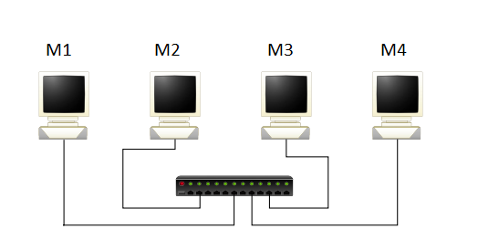
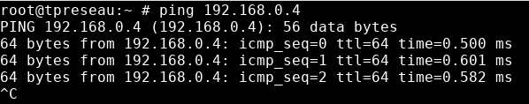
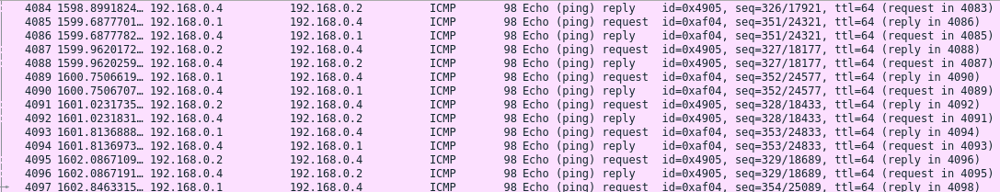
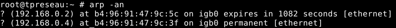
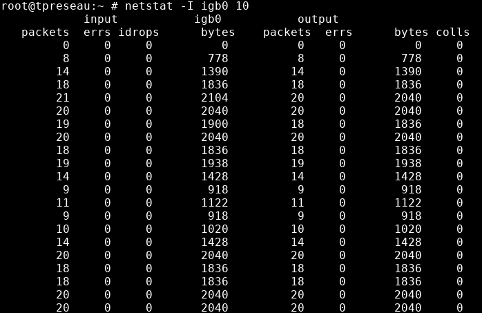
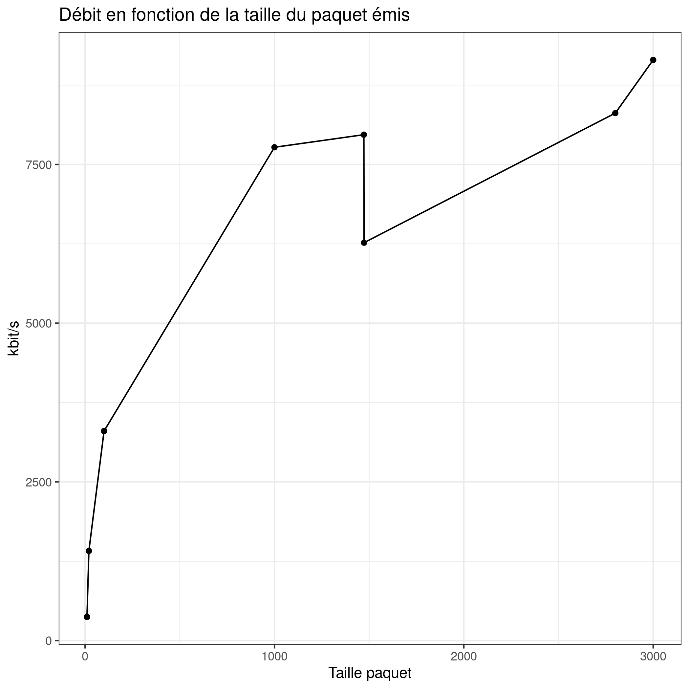

# Choix des adresses



Tous les ordinateurs étaient branchés au Hub avec des câbles torsadés droits.

Nous avons choisi 192.168.0.0/24 (classe C) comme adresse pour le réseau. Nous avons également fait le choix de réserver les 24 premiers bits pour identifier le réseau comme nous savions que nous allions pas utiliser beaucoup de machines. De ce fait,
nous avons décidé d’allouer 8 bits (1 octet) pour la partie machine à l’aide du masque, qui nous permet de délimiter la partie réseau et la partie machine.


Les adresses des différentes machines sont les suivantes:

- M1: 192.168.0.1/24
- M2: 192.168.0.2/24
- M3: 192.168.0.3/24
- M4: 192.168.0.4/24

L’interface utilisée est bge0 qui permet de détecter les collisions. Voici comment nous avons configuré la première machine :

```bash
ìfconfig bge0 192.168.0.1/24
```

# Configuration des interfaces

**Netmask**: 0xffffff00 -> 255.255.255.0

Cela permet de nous indiquer quels octets définissent lapartie réseau et ceux qui sont destinés à identifier la machine.

**Adresses de Broadcast**: 192.168.0.255

Cela permet de nous indiquer quelle est l’adresse maximale du réseau, nous avons donc des adresses comprises entre la plage 192.168.0.1 et 192.168.0.254 inclues, ce qui signifie que le nombre d’adresse IP pour ce réseau est de 255.

# Commande ping

La commande ping permet d’envoyer à intervalle régulier des paquets à la machine de destination, puis cette machine envoie une réponse ping toujours sous forme de ping. Cette commande permet de voir si deux machines sont bien connectées entre elles sur un réseau. Cette commande utilise le protocole ICMP (Internet Control Message Protocol) qui contient :

- Un type et un code (message d'erreur)
- Un checksum (validité du paquet)
- Un identifiant
- Un numéro de séquence (vérification de paquets perdus)
- des données





# Paquets ARP

La commande ping permet d’émettre des paquets de type ARP vers une adresse de destination qui n’a pas encore été utilisée. Dans ce cas-là, elle sera alors ajoutée dans ce que l’on appelle la table ARP, qui permet de stocker les résolutions MAC-IP par les ordinateurs, serveurs et éléments actifs du réseau, elle permet d’accélérer les échanges. La table ARP ne conserve pas ces adresses vers les autres machines du réseau indéfiniment, elles sont effacées au bout d’un certain temps pour ne pas encombrer la mémoire inutilement.



# Collisions et protocole CSMA/CD

Avec la commande **netstat**, entre les machines M1 et M2, le nombre de collisions et d’erreurs sont nuls. On peut expliquer cela par le flux de données dans notre réseau qui va de la machine M1 à M2



Nous effectuons la commande **udpmt** entre les machines M3 et M4 pour émettre des paquets et observer des collisions sur la machine émettrice. Après 1 minute, le nombre de collisions en moyenne est de 800 collisions toutes les 10 secondes. On peut expliquer cette augmentation, par les deux trafics que nous effectuons en simultanée. Le protocole CSMA/CD permet donc de limiter le nombre de collisions.

Nous pouvons observer que plus la taille du paquet émis est grande, plus le nombre de collision est faible. La machine qui écoute sur le réseau attend la fin du paquet en cours. Si les paquets sont petits, plus il y a d'espace vide ou rien n'est reçu. Il y a alors plus de chance que la machine écoutant pense que le message est terminé. Plus les paquets sont grands, moins il y a d'espace d'attente et moins il y a de chance de se tromper.

# Calcul de Tprop

La formule pour calculer Tprop est: $Tprop = L / V$

L = la taille du câble ETHERNET

V= Vitesse de l’onde dans le câble

Dans notre cas L vaut 1,5 mètres et V vaut $2*10^(8) m/s$

On a donc: $Tprop = 7,5*10^-9s$

On peut donc calculer l’efficacité:

# Débits

Le protocole CSMA/CD est utilisé lorsque nous utilisons la commande **udpmt**. Le protocole CSMA (Carrier Sense Multiple Access) permet de de détecter si un support est libre. Si c’est le cas, alors on peut lui transmettre des paquets. CD (collision detection) permet de savoir s’il y a une collision. Si c’est le cas, on arrête la transmission. Même si nous n’avons pas expérimenté de collisions, on peut penser que plus les paquets sont gros, plus la communication entre deux machines
est longues. Donc une collision a plus de chance de se produire.

Voici nos mesures effectuées sur le débit par rapport à la taille du paquet envoyé :

| Taille paquet | débit mesuré kbit/s |
|---------------|--------|
| 10            | 373    |
| 20            | 1413   |
| 100           | 3300   |
| 1000          | 7771   |
| 1472          | 7969   |
| 1473          | 6268   |
| 2800          | 8303   |
| 3000          | 9147   |

{height=300px}

Nous pouvons remarquer un saut de la courbe entre les valeurs 1472 et 1473. Cela est du à la quantité maximale d'octets que nous pouvons émettre. Cette valeur est de 1500 octets, hors 8 octets et 20 octets sont réservés respectivement à UDP et IP. Il ne reste donc plus que 1472 octets disponibles consacrés aux données. Ce qui veut dire que les paquets ayant une taille supérieure à 1472 octets sont envoyés en plusieurs fois, d'où la diminution du débit.

# Débit applicatif

Débit Théorique applicatif $= (taille donnée / taille paquet) * Débit physique$

Ici les entêtes mesurent au total 66 octets puisque nous avons 12 octets de silence, 8 de préambule, 8 d'UDP, 20 d'IP et 18 d'Ethernet.

La taille du paquet correspond à la taille des données et la taille des entêtes.

Nous prendrons $10^7$ pour le débit physique. Voici le tableau des débits applicatifs :

| Taille paquet | débit mesuré kbit/s | débit applicatif kbit/s |
|---------------|---------------------|-------------------------|
| 10            | 373                 | 10526                   |
| 20            | 1413                | 18605                   |
| 100           | 3300                | 48193                   |
| 1000          | 7771                | 75046                   |
| 1472          | 7969                | 76567                   |
| 1473          | 6268                | 76569                   |
| 2800          | 8303                | 78157                   |
| 3000          | 9147                | 78278                   |