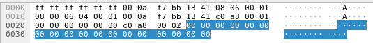
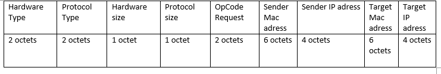
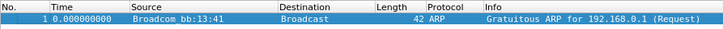
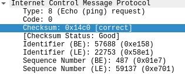

## Q1. Identification des paquets de type ARP

Pour vérifier qu'un paquet est de type ARP il faut regarder le champ `TYPE` dans la trame Ethernet. Si le champ `TYPE` est égal à `0x0806` alors le paquet est de type ARP.



## Q2. Paquet ARP dans Ethernet

Nous pouvons retrouver le paquet ARP encapsulé dans la partie `DATA` de la trame.

## Q3. Schéma paquet ARP



- Hardware type indique le type de matériel (protocal de communication de niveau 2)

- Le type de protocole de la couche 3 (ici IP)

- Type d'opération (request ou reply)

- L'adresse mac de l'émetteur

- L'adresse IP de l'émetteur

- L'adresse mac pointée (si elle est connue)

- L'adresse IP pointée (si elle est connue)

## Q4. Taille et fin de trame

Le niveau Ethernet ne connaît pas la taille des paquets qu'il reçoit. La longueur est calculée grâce 
à un silence dans la trasmissions des données.

Nous pouvons voir les octets de bourrages rajoutés à la fin qui sont tous à 0. Il sont insérés pour que le champ `DATA` fasse au moins 46 octets de longueur.

## Q5. Transmission à la couche ARP

A la reception de ARP, c'est l'intégralité du champ `DATA` qui est transmis à la couche ARP, soit le paquet ARP ainsi que les octets de bourrages.

## Q6. Algorithme

```
tantque vrai faire
	attendre(evenement)
	si evenement est "Question sur adresse internet"

	finsi

	si evenement est expiration du timer d'effacement associé à une entrée
		Supprimer l'entrée de la table ARP
	finsi

	si evenement est reception requete
		si la machine emettrice est dans la table ARP
			remettre le timer à 0
		sinon
			ajouter la machine emettrice dans la table
	finsi

	si evenement est reception reponse

	finsi

	si evenement est "Configuration d'une interface"
		emission d'un ARP Gratuit
	finsi
fintantque

```

## Q7. Tables ARP A et B

On voit que B apparaît dans la table de A car A a précédemment envoyé une reqûete ARP afin de connaître l'adresse de B. La machine B lui a envoyé son adresse MAC en retour. B a par ailleurs appris l'adresse de A, sans envoyé de ARP Request, lors de la reception de la requête de A. La machine B a stocké l'adresse IP et MAC de la machine A à ce moment-là.

## Q8. Paquets engendrés de A vers B

La machine B ne connaît plus l'existence de la machine A car nous avons supprimé l'entrée correspondante. Lorsque le ping atteint la machine B, elle ne connaît pas la machine A et c'est donc impossible pour elle de répondre. La machine B envoie donc des paquets ARP Request pour connaître l'adresse de l'emetteur. La machine A repond par un ARP Reply pour qu'ensuite la machine B renvoie un ICMP reply qui est le retour du ping.

## Q9. Timer ARP

Après la suppression de l'entrée de la machine B dans la table A, on remarque que lorsqu'on essaie de faire un ping de A vers B, il y a des envois de paquets ARP Request à intervalle régulier de 1 seconde. C'est donc le protocole ARP qui déclenche des rémissions des paquets ARP toutes les secondes.

## Q10. ARP _gratuit_

Le ARP _gratuit_ est envoyé lors de la configuration d'une interface. C'est un paquet qui est émis en broadcast à tout le réseau sans qu'on lui ai demandé. C'est une manière d'avertir au réseau de la mise à jour ou de l'initialisation de son adresse IP.



## Q11. Deux paquets ARP reply

On peut y voir deux paquets de type ARP Reply car la machine C, ne connaissant pas la machine B, envoie un ARP Request en broadcast sur le réseau. La machine B recevant l'ARP Request répond en envoyant son adresse IP. De plus, la machine A envoie également un ARP Reply car sa table d'adresse contient celle de la machine B.

## Q12. Adresse _Publish_

Cette fonction serait utile dans le cas d'un proxy car le proxy pourrait répondre aux requete ARP même lorsqu'il y a plusieurs sous réseau.

## Q13. Même adresse Internet sur un réseau local

Au moment de la configuration de la seconde machine avec la même adresse IP, on remarque une message d'erreur. Ceci est dû à la requête ARP _gratuite_ qui s'envoie à l'initialisation de l'interface.

## Q14. Envoie d'un ping sur l'IP commune

Lorsqu'on envoie un ping sur l'IP partagée, c'est la dernière machine qui a été configurée avec cette adresse qui reçoit le message. C'est en effet la dernière a avoir mis a jour la table ARP.

## Q15. Champs **Identifier** et **Séquence Number**

le champ Séquence Number reste le même entre un ARP Request et son Reply correspondant. Ce champs augmente à chaque couple de paquet. Cela permet d'identifier et de raccorder les deux paquets au cas où d'une perte.

## Q16. Calcul Checksum

Le checksum est calculé en additionnant tous les octets de l'entête ainsi que les 4 premiers octets de la zone `DATA`. A la fin de l'addition, on inverse les bits et on obtient le resultat final. Cela nous permet de detecter les erreurs dans l'entête, mais pas les erreurs en colonne.

Voici ce que nous avons calculé pour un paquet ICMP que nous avons observé (le champ `DATA` est consituté uniquement de 0):




| Nom      |   |   |   |   |   |   |   |   |   |   |   |   |   |   |   |   |
|----------|---|---|---|---|---|---|---|---|---|---|---|---|---|---|---|---|
| Type     | 0 | 0 | 0 | 0 | 1 | 0 | 0 | 0 | 0 | 0 | 0 | 0 | 0 | 0 | 0 | 0 |
| Code     | 0 | 0 | 0 | 0 | 0 | 0 | 0 | 0 | 0 | 0 | 0 | 0 | 0 | 0 | 0 | 0 |
| ID       | 1 | 1 | 1 | 0 | 0 | 0 | 0 | 1 | 0 | 1 | 0 | 1 | 1 | 0 | 0 | 0 |
| SEQ      | 0 | 0 | 0 | 0 | 0 | 0 | 0 | 1 | 1 | 1 | 1 | 0 | 0 | 1 | 1 | 1 |
| Sum      | 1 | 1 | 1 | 0 | 1 | 0 | 1 | 1 | 0 | 0 | 1 | 1 | 1 | 1 | 1 | 1 |
| Checksum | 0 | 0 | 0 | 1 | 0 | 1 | 0 | 0 | 1 | 1 | 0 | 0 | 0 | 0 | 0 | 0 |

Nous pouvons vérifier que le checksum est bien égal à `0x14C0`.

## Q17. Paquets capturés DHCP

La commande `dhclient em0` envoie une demande d'adresse ip sur le réseau. S'en suit alors une suite de paquets de type `DHCP` :

- DHCP Discover est le paquet envoyé par le client en broadcast sur le réseau pour découvrir qui est le serveur.

- DHCP Offer est le paquet renvoyé par le serveur lui informant sa propre IP ainsi que les choix disponibles que le client peut prendre comme IP.

- DHCP Request est la réponse du client demandant une IP précise dans la liste proposée par le serveur.

- Enfin, DHCP ACK est la réponse finale du serveur lui accordant l'IP et toutes les configurations nécessaires (masque et gateway) en lui informant de la durée du bail également.

## Q18. Paquet UDP de 4600 octets

Comme la taille du paquet UDP est trop importante, il faut l'envoyer en 4 paquets de 1500 octets car c'est la taille maximale. On remarque que le champ `IDENTIFICATION` reste le même pour tous les paquets car c'est le moyen de rellier tous les paquets entre-eux. Le champ `TOTAL LENGTH` permet d'indiquer la taille total du paquet courrant. Enfin, le champ `FRAGMENT OFFSET` sert à positionner la position de ce fragment dans la chaîne original.

On remarque que l'entête UDP n'apparaît que dans un seul paquet (le premier) car le protocol IP reconstruit le paquet qu'il encapsule et cette information serait inutile si elle apparaissait dans tous les fragments. Les fragments sont envoyés dans l'ordre croissant avec le plus petit offset en premier.
