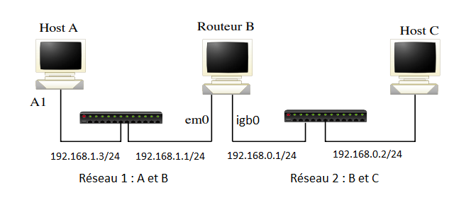

## Q1

A l'aide de **ping** on remarque que toutes les stations ne communiquent pas ensemble. En l'occurence, le poste A ne peut pas atteindre le poste C et vice-versa. Cela est dû au fait que ces deux machines ne soient pas sur le même réseau.

Après voir ajouté manuellement dans la table de routage de A une entrée permettant d'atteindre le réseau 2 puis d'avoir lancé la commande `sysctl net.inet.ip.forwarding=1` sur le routeur B, le ping part bien de la machine A mais ne revient pas. Cela s'explique par le fait que A connaisse le réseau de C mais pas l'inverse. Il a fallu donc ajouté dans la table de routage de C l'entrée permettant d'atteindre le réseau de A. Ensuite, le ping de A vers C a pu faire l'aller et le retour.

## Q2

## Q3

Il faut configurer une passerelle par défaut dans la table de routage pour pouvoir atteindre le "reste du monde".

## Q4

La combinaison de l'adresse `0.0.0.0` et du netmask `0.0.0.0` concerne toutes les machines car le netmask permet d'atteindre toutes les adresses possibles.

## Q5

Lorsque A ping vers une adresse inconnue, le routeur B (voir screen)

## Q6

L'inconvénient de ce routeur par défaut est que si une destination inconnue veut être atteint, il y aura une boucle de requête en continu. De plus, les reqûetes eronnées vont aussi surcharger le réseau L'avantage est que chaque machine peut atteindre n'importe quel autre host sur un autre réseau ou non, ce qui est très pratique.

## Q7

Après avoir lancé les démons on remarque dans les tables de routage de A et de C qu'une entrée a automatiquement été entrée. Cette entrée désignant le réseau de l'autre machine (A contient une ligne pointant sur le réseau de C). On en conclue que le protocole RIP permet de mettre à jour automatiquement les tables de routage. Lors d'un ping entre A et C, on remarque qu'il n'y a pas de problème et que les machines communiquent bien ensemble.

## Q8

(screen)

Les informations échangées par le protocole RIP sont la distance (metric) qui sépare la station de l'adresse ainsi que l'adresse des réseau inconnus en broadcast (c'est pour cela qu'on reçoit deux exemplaires). L'intervalle de temps d'émission automatique des deux paquets RIP et de 30 secondes. 

## Q9

4 minutes après avoir débranché la station A du réseau 1, on remarque qu'une ligne a disparu dans sa table de routage. En effet, l'entrée dirigeant vers le réseau 2 (de C) a été suprimée.

Après avoir reconnecté la station A sur le réseau, on remarque qu'après 30 secondes, l'entrée revient.

## 10

Le protocole RIP envoie toutes les 30 secondes des paquets contenant les adresses des différents réseaux à inclure dans les tables de routage.

## 11

Lorsque nous avons tué le demon de la machine B, celle-ci a envoyé des paquets RIPV1 sur les adresses de broadcast de tous les réseaux auxquels elle est connectée. On peut voir à l'intérieur de ces paquets que le champ _metric_ valait `16`. Cette distance indique que les réseaux sont inatégnables et que toutes les machines recevant cette information ont supprimé les entrées correspondantes.

## 12

Lorsque l’on relance le démon de routage sur B et que l’on tue et relance le demon sur C, on remarque l’émission de RIP request en broadcast, les machines répondent avec un RIP response ( pas en broadcast) et mettent à jour leur table de routage.

\newpage

## 13

## 14

Il faut ajouter :

- Pour la machine A :

	- Le réseau 2 (`192.168.0.0`)
	- Le réseau 3 (`10.9.8.0`)

- Pour la machine B :
	
	- Le réseau 3 (`10.9.8.0`)

- Pour la machine C :
	
	- Le réseau 1 (`192.168.1.0`)

- Pour la machine D :
	
	- Le réseau 1 (`192.168.1.0`)
	- Le réseau 2 (`192.168.0.0`)

## 15

**Léo doit me l'envoyer**

## 16

Au lancement des démons RIP, on observe des envois de paquets RIP Request permettant aux routeurs de s'échanger les réseaux qu'ils connaissent. Ces paquets sont émis directement après le lancement des démons et n'attendent pas le timer normal, ceci pour accélerer la création de routes.

## 17

