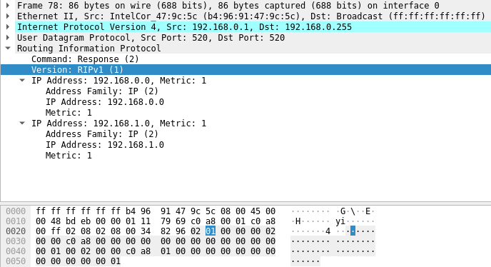

## Q1


A l'aide de **ping** on remarque que toutes les stations ne communiquent pas ensemble. En l'occurence, le poste A ne peut pas atteindre le poste C et vice-versa. Cela est dû au fait que ces deux machines ne soient pas sur le même réseau.

Après voir ajouté manuellement dans la table de routage de A une entrée permettant d'atteindre le réseau 2 puis d'avoir lancé la commande `sysctl net.inet.ip.forwarding=1` sur le routeur B, le ping part bien de la machine A mais ne revient pas. Cela s'explique par le fait que A connaisse le réseau de C mais pas l'inverse. Il a fallu donc ajouté dans la table de routage de C l'entrée permettant d'atteindre le réseau de A. Ensuite, le ping de A vers C a pu faire l'aller et le retour.

## Q2

On remarque que :
192.168.1.3 ne peut pas ping 192.168.0.1
192.168.1.3 ne peut pas ping 192.168.0.2
192.168.0.2 ne peut pas ping 192.168.1.1
et 192.168.1.3 ne peut pas ping 192.168.0.2

Mais si on ajoute un : `route add 192.168.0.0/24 192.168.1.1` sur la machine A.

Si le forwarding n'est pas fait sur la machine B il n'y a pas d'erreur sur la machine A mais la machine C ne reçoit rien. Cela provient du faite que B ne fait pas son travail de routeur, c'est à dire qu'il ne transmet pas les trames envoyées par A vers C.
Si le forwarding est fait sur B il n'y a plus d'erreur chez A. Le ICMP echo request sont reçus par C. On a donc une communication à sens unique entre 192.168.1.3 -> 192.168.0.2. Mais il ne peut pas lui répondre étant donné qu'il ne le connait pas, C ne connait pas A.

Pour régler le probleme il faut ajouter : `route add 192.168.1.0/24 192.168.0.1`
Cela permet à C de répondre à A car il sait où il est et peut atteindre son réseau.

{height=400px}

## Q3

Il faut configurer une passerelle par défaut dans la table de routage pour pouvoir atteindre le "reste du monde". Cela permet de cibler toutes les adresses IP que la table ne connaît pas. Au cas où la station ne connaît pas l'IP où envoyer des paquets, l'entrée/sortie par défaut permet d'atteindre n'importe qui et donc les paquets arriveront à destination.

## Q4

La combinaison de l'adresse `0.0.0.0` et du netmask `0.0.0.0` concerne toutes les machines car le netmask permet d'atteindre toutes les adresses possibles.

## Q5

Lorsque A ping vers une adresse inconnue, le message `Destination Host Unreachable` est retourné. Ce message est envoyé par le routeur par défaut (B) ou directement de A si la station n'a pas renseignée de routeur par défaut.


## Q6

L'inconvénient de ce routeur par défaut est que si une destination inconnue veut être atteint, il y aura une boucle de requête en continu. De plus, les reqûetes eronnées vont aussi surcharger le réseau L'avantage est que chaque machine peut atteindre n'importe quel autre host sur un autre réseau ou non, ce qui est très pratique.

## Q7

Après avoir lancé les démons on remarque dans les tables de routage de A et de C qu'une entrée a automatiquement été entrée. Cette entrée désignant le réseau de l'autre machine (A contient une ligne pointant sur le réseau de C). On en conclue que le protocole RIP permet de mettre à jour automatiquement les tables de routage. Lors d'un ping entre A et C, on remarque qu'il n'y a pas de problème et que les machines communiquent bien ensemble.

## Q8



Les informations échangées par le protocole RIP sont la distance (metric) qui sépare la station de l'adresse ainsi que l'adresse des réseau inconnus en broadcast (c'est pour cela qu'on reçoit deux exemplaires). L'intervalle de temps d'émission automatique des deux paquets RIP et de 30 secondes. 

## Q9

4 minutes après avoir débranché la station A du réseau 1, on remarque qu'une ligne a disparu dans sa table de routage. En effet, l'entrée dirigeant vers le réseau 2 (de C) a été suprimée.

Après avoir reconnecté la station A sur le réseau, on remarque qu'après 30 secondes, l'entrée revient.

## Q10

Le protocole RIP envoie toutes les 30 secondes des paquets contenant les adresses des différents réseaux à inclure dans les tables de routage.

## Q11

Lorsque nous avons tué le demon de la machine B, celle-ci a envoyé des paquets RIPV1 sur les adresses de broadcast de tous les réseaux auxquels elle est connectée. On peut voir à l'intérieur de ces paquets que le champ _metric_ valait `16`. Cette distance indique que les réseaux sont inatégnables et que toutes les machines recevant cette information ont supprimé les entrées correspondantes.

## Q12

Lorsque l’on relance le démon de routage sur B et que l’on tue et relance le demon sur C, on remarque l’émission de RIP request en broadcast, les machines répondent avec un RIP response ( pas en broadcast) et mettent à jour leur table de routage.

## Q13


## Q14

Il faut ajouter :

- Pour la machine A :

	- Le réseau 2 (`192.168.0.0`)
	- Le réseau 3 (`10.9.8.0`)

- Pour la machine B :
	
	- Le réseau 3 (`10.9.8.0`)

- Pour la machine C :
	
	- Le réseau 1 (`192.168.1.0`)

- Pour la machine D :
	
	- Le réseau 1 (`192.168.1.0`)
	- Le réseau 2 (`192.168.0.0`)

## Q15

{height=300px}

## Q16

Au lancement des démons RIP, on observe des envois de paquets RIP Request permettant aux routeurs de s'échanger les réseaux qu'ils connaissent. Ces paquets sont émis directement après le lancement des démons et n'attendent pas le timer normal, ceci pour accélerer la création de routes.

## Q17

- Au lancement du démon sur la station A, des paquets RIP Request sont envoyés en broadcast pour demander des informations aux routeurs (pas encore allumés)

- Le lancement du démon sur le routeur B, un paquet RIP Request ainsi qu'un RIP response car il répond à lui-même.

- Lors du lancement du démon sur le routeur C, un RIP Request est demandé et directement après, un RIP response est reçu venant du routeur B. Puis, toutes les 30 secondes, le routeur C envoie des paquets RIP (request/response)

- Au lancement du démon sur la station D, un RIP Request est envoyé comme pour A et reçoit des RIP response venant du Routeur C.

On remarque que les routeurs n'attendent pas 30 secondes entre l'émission de chaque paquet car dès qu'ils reçoivent un RIP response, ils en renvoie un directement après pour partager de potentielles nouvelles informations et parceque les stations renvoient un RIP response également.

## Q18

Routeur B a appris sa route via le routeur C, il ne faut donc pas ré-émettre une route normale verrs Routeur C.
En effet, en cas de déconnection du cable de routeur C sur le net C, le routeur C pourrait croire qu'il peut rediriger via le routeur B. Cela engendrerai une route ayant une métrique incrémentée de 1 et cela ferai une route "fantome" qui ne mène nulle part.

## Q19

Lorsqu'on tue le demon RIP du routeur B, on remarque qu'il envoie des sa table de routage en broadcast ayant une métrique de 16 à toutes ses entrées. Il annonce qu'il ne faut plus passer par lui car il est devenu innaccessible. Cela provoque le fait que le routeur C met à jour le réseau 1 avec une métrique 16 car il ne peut plus y accéder. Ces paquets servent donc à mettre à jour les tables et liens entre les réseaux lorsqu'un routeur deviant inaccessible.

## Q20

Cette version de RIP implémente la méthode de la _mise à jour déclenchée_ car RIP a émis un paquet comportant la modification faite au réseau. La modification étant que le routeur C indiquait qu'il ne pouvait plus atteindre le réseau 1 (de A) et que le routeur B envoyait des métriques de 16 pour tous ses réseaux.

## Q21


## Q22

On remarque que, pour atteindre le réseau B, le paquets passent par la station D. Cela est dû au fait que B n'est plus un routeur, les paquets sont donc redirigés vers le routeur D qui les envoies à son tour au routeur C.

Contenu paquets RIP sur le réseau :

- 1 (A - B)
    - Aucun paquet RIP car aucun routeur
- 2 (B - C) (Routeur C envoie des paquets RIP)
    - Réseau 2 (actuel) est de métrique 1
    - Réseau 3 est de métrique 1
    - Réseau 4 est de métrique 2
- 3 (C - D)
    - Réseau 1 inconnu (aucun routeurs)
    - Réseau 2 métrique 1
    - Réseau 3 (actuel) métrique 1
    - Réseau 4 métrique 16
- 4 (D - A)
    - Réseau 1 inconnu
    - Réseau 2 métrique 2
    - Réseau 3 métrique 1
    - Réseau 4 (actuel) métrique 1


## Q23

En lançant le démon de routage en mode supply, la machine A accède au réseau 2 en passant par la station B (interface em0). Cela permet à la machine A d'atteindre le réseau en prenant le chemin le plus court (connu grâce aux métriques). RIP fonctionne alors en regardant les métrique sles plus faibles pour choisir le chemin le plus court.

## Q24

RIP utilise deux types de machines : 

- les stations (hosts) qui utilisent les paquets RIP reçus sur le réseau pour mettre à jour leurs tables de routage.
- les routeurs qui servent à informer les stations et les autres routeurs des modifications (nouvel host, routeur éteint...) et des caractéristiques (réseaux et distance) sur le réseau.

Au démarrage du protocole (premiers paquets envoyés), toutes les machines envoient des paquets RIP en broadcast pour se faire connaître et pour connaître les caractérstiques du réseau si elles existent. Les routeurs informent les stations hosts quand celles-ci envoient des requêtes en envoyant les réseaux connus. A chaque fois qu'une station recçoit un paquet RIP, elle met à jour ou insère dans sa table de routage les données reçues en actualisant la métrique (distance nécessaire pour atteindre le réseau). Si une route plus courte vers un réseau connu est découvert, la station met à jour sa table en remplaçant la passerelle vers ce réseau par le routeur qui a émis le paquet.

## Q25

{height=300px}

## Q26

A partir de A, on passe par le routeur B pour accéder au réseau 3 car c'est le chemin le plus court. Nous vérifions que les deux machines peuvent s'atteindre avec un `ping`.

## Q27

Le ping ne fonctionne pas le temps que RIP mette à jour les tables de routage. Une fois la mise à jour effectuée, on voit que la station A accède au réseau 1 via le routeur B.

## Q28

- Les paquets RIP émis par un routeur contiennent les réseaux connus par ce routeur ainsi que les métriques correspondantes.
- Ce n'est pas le même paquet RIP qui est émis car les métriques peuvent différer
- RIP ne mémorise pas plusieurs routes, il va garder le chemin le plus court (métrique la plus faible)
- La partie _réseau_ est calculée suivant le netmask associé
- Les paquets RIP ne transportent pas les netmasks associés
- RIPV1 assume que tous les réseaux ont le même netmask
- Si le routeur emettant un paquet est le même mais que la métrique est supérieure alors on le prend en compte. Sinon on ne prend en compte que si la métrique est inférieure et que la destination a changée.
- Si un routeur ré-annonce une route connue mais avec un coût supérieur, la réponse est ignorée et les tables restent inchangées
- Si machine à la réception est un routeur alors il envoit sa table de routage, si c'est une station host rien ne se passe.
- Lorsque le démon est arrêté sur une machine il envoie un dernier paquet contenant des métriques à 16.

## Q29
```
tantque vrai faire
attendre (événement)
• si événement est “réception d’un paquet RIP response”
Pour chaque adresse contenue dans le paquet RIP faire :
    - Si @destination inconnue alors
        • rajouter dans la table de routage (@destination, @routeur, cout +1)
        • armer timer
    finsi
    - Si @destination connue alors (apparait dans la table (@destination, @routeur_voisin, cout_présent))
        • Si @routeur_voisin = @routeur alors
            – changer table (@destination, @routeur, cout + 1)
            – relancer timer
        finsi
        • Si @routeur_voisin != @routeur et cout+ 1 < cout_présent alors
            – changer table (@destination, @routeur, cout + 1)
            – relancer timer
        finsi
    finsi
finsi

• si événement est “réception d’un paquet RIP request” 
-->dans le cas d'un -s (routeur)
Envoie directement sa table de routage

-->dans le cas d'un -q (non routeur)
Ne fais rien
 
finsi

• si événement est expiration du timer associé à une entrée dans la table de routage
Suppression de la ligne correspondante à l'entrée
finsi

• si événement est expiration du timer d’émission de paquet RIP (seulement pour un routeur)
Envoi d'un paquet RIP avec toutes les informations de la table de routage
finsi

• Si sonnerie d'un timer (2min30) alors 
Supprimer de la table la destination correspondante
finsi

fin tantque
```