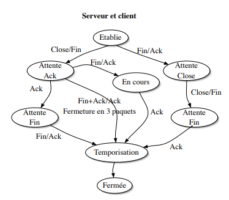

## Q2

Le numéro de port n'est pas obligatoirement le même sur les deux machines, cela est indépendant puisqu'il est relatif à la machine.
Il est cependant impossible d'utiliser deux fois le même numéro de port car un port est égal à une communication. On ne peut pas avoir deux communications au même endroit en même temps.

## Q3

{height=450px}

Ce paquet est constitué du port UDP source, du port UDP destination de la taille en octet du message et d'une détection d'erreur optionnelle en IPV4 mais obligatoire en IPV6. Puis après cette courte entête nous avons : 
- Numéros de port (sur 2 octets)
- Longueur en nombre d’octets (sur 2 octets)
- Détection d’erreur optionnelle (par “checksum”)

Il y a le message (surligné en bleu sur la capture wireshark ci-dessus). Il ne faut pas oublier toutefois que ce protocole est encapsulé par d'autres couches notamment la couche 3 _Réseau_.

## Q4

L'identificateur de socket correspond à un port relié à une addresse. On doit connaître l'id pour identifier le paquet qui sera émis. On ne connaît pas l'identifiant de la socket distante car elle est liée au poste distant.

## Q5
Les champs de l'entête UDP :

- Source port : port de la machine émettrice
- Dest port : port de la machine distante
- Length : longeur du message
- Checksum : permet d'assurer l'intégrité du paquet reçu. Il est calculé à partir des informations de l'entête UDP et des données.
- Data : les données transmises

L'ensemble du protocole UDP est transmis à IP.

## Q6

- Demander la réception avant émission : Le message est affiché dès lors qu'il est émis et donc arrivé à l'host. Il n'y a pas de confirmation de connexion entre les deux machines, l'une écoute sur un port et il peut, ou pas, y avoir de message. En demandant la réception avant, la machine écoute sur le port en espérant entendre quelque chose. Dès que le message arrive, la machine le lis.
- Plusieurs paquets avant réception : Nous avons besoin de lancer la commande `rcvfrom` une fois pour chaque message, le premier `rcvfrom` récupère que le premier paquet envoyé.
- Aucune collisions quand envoie et receptionne en même temps. Demander à recevoir plus d'octets revient à recevoir tout le message sans superflux et demander à recevoir moins d'octets c'est recevoir que une partie du message
    - exemple envoi "bonjour" (7 longueur) : reception de 1 octet = "b"
    - exemple envoie de bonjour (7 longueur) : reception de 999 octets = "bonjour"
- Envoie vers une machine débranchée : aucun envoie / aucune trace (rien sur wireshark)

## Q7

Le troisième paquet de 4000 octets s'est fait rejeté car il n'y avait pas la place (12k > taille du buffer de récéption de 10k). Si on envoie un petit message, celui-ci arrive à destination car il y a 2k octets de libre.

## Q8

Lors d'un envoi d'un paquet UDP vers un port inexistant, on remarque un paquet ICMP envoyé vers l'émetteur `Destination unreachable (port unreachable)`. Le paquet arrive jusqu'à UDP (couche transport) (car IP est connue donc ça passe mais quand ça arrive à UDP, UDP dis qu'il ne connait pas de socket avec ce port) et UDP déclanche un ICMP.

## Q9

UDP (User Datagramme Protocol) est un protocole permettant la transmissions de données entre deux entités. Ces entités possèdent un numéro de port et une adresse IP. L'objectif principal de ce protocole est d'être très léger et rapide, néglige totalement les autres points, telle que la correction d'erreur ou même la bonne réception des paquets. Notamment, on ne vérifie pas si la deuxième machine existe ou si son buffer est plein. La correction d'erreurs ou autre doit donc ce faire ou niveau applicatif si le programmeur le souhaite. Ensuite, il n'y a pas de ré-émission de paquet il n'y a donc aucune fiabilité du réseau. Néanmoins ce protocole est simple et rapide.


## Q10

La première socket créée est _passive_ car elle attend une connexion (c'est le serveur). L'autre est _active_ car elle établit la connnection entre les deux machines.

## Q11

Une socket est égale à une connexion donc il faut donc la dupliquer pour permettre à d'autres machines de se connecter au serveur.

## Q12

{height=200px}

## Q13

Le flag **SYN** est utilisé pour initialiser et établir une connexion. Il permet également de synchroniser les numéros de séquence. Les numéros de séquence et d'acquittement permettent au client et au serveur de se mettre d'accord sur les paquets reçus et émis. Le serveur incrémente le numéro de séquence lorsqu'il reçoit un paquet en guise de validité de réception. Le client reçoit le numéro de séquence incrémenté et comprend que le paquet est bien arrivé à destination.
Les options lors de l'ouverture de connexion par TCP :

Les options TCP sont composées de :
- la taille maximale du segment
- l’échelle de la fenêtre
- TCP Sack Permitted Option
- Timestamp : TSval et TSecr


## Q14
- accept avant connect : attente du connect
- accept apres connect : connection instantanée


Lorsqu'on ouvre plusieurs connexions d'une machine vers un même port destinataire, on peut voir que dans la liste des sockets, les modifications ont pu être faite.

\newpage

## Q15

{height=250px}

## Q16

Les deux numéros de port ainsi que les deux numéros de séquence permettent d'identifier une connexion.

## Q18

Lorsqu'on essaye de se connecter à un port inexistant, la machine distante renvoie une trame contenant le flag RST. Le flag Reset permet de signaler un état inconnu/incertain de la connexion. Cela permet de faire remarquer à la machine émettrice une erreur et qu'il faut qu'elle réinitialise sa connexion.

## Q19

{height=450px}

Les champs SEQUENCE NUMBER et ACK NUMBER permettent de compter le nombre d'octets qui sont envoyés d'un côté et réceptionnés de l'autre. Ce systeme permet de vérifier l'intégrité des données envoyées. Le SEQUENCE NUMBER est incrémenté quand un paquet TCP est envoyé tandis que ACK NUMBER est incrémenté quand la machine host a reçu des paquets TCP.

## Q20

On remarque qu'il n'y a pas toujours d'acquittement pour chaque paquet. Un seul acquittement peut suffir pour valider la réception de plusieurs paquets.

## Q21

Comme dit précédemment, UDP ne renvoie pas de paquet s'ils sont perdus. Contrairement à TCP qui assure de ré-envoyé les paquets perdus. 

## Q22

{height=450px}

## Q23

Dans le cas d'un buffer trop petit, cela va réduire le débit applicatif. Premièrement, le buffer sera utilisé à de multiple reprise avec des parcours de ce dernier à chaque fois. Le simple parcours est négligeable mais la répétition elle ne l'est pas est augmente la latence. De plus, à chaque fois il faut ajouter une entête donc des trames avec peu de données va réduire le débit. Inversement, si la taille de ce buffer est grande le débit sera plus élevé. La latence dépendra grandement de ce temps d’émission.

## Q24

Débit applicatif = taille du buffer / RTT

Pour 2000 octets:
Débit applicatif : 1000/20 = 50 Ko/s 

Pour 4000 octets:
Débit applicatif : 2000/20 = 100 Ko/s

Pour 10000 octets:
Débitapplicatif : 10000/20 = 500 Ko/s

## Q25

La taille optimale du buffer se calcule avec la formule suivante: RTT * débit minimale du réseau.
Le débit minimum que l'on utilise est de 10 mo/s, alors on trouve une taille de 200 000 octets.

## Q26

Si l'on utilise un buffer d'émission de taille non adéquate à la latence du réseau, ce dernier peut se remplir plus vite qu'il ne se vide, et peut donc perdre des paquets dans le cas où le buffer reste constamment plein.

## Q27

**Récepteur:**

```
Tant que(Vrai){
  Si SEQ est attendu alors on retourne ACK = SEQ + longueur
}
```

Si le paquet reçu n'est pas celui attendu alors le paquet est mémorisé dans le buffer de réception mais aucun acquittement n'est envoyé

**Emetteur:**

Envoie le premier paquet.
Si pas d'acquittement après la fin du timer alors le timer est réévalué et armé à nouveau. Si on est pendant notre timer, on continue à envoyer les paquets en incrémentant le SEQ comme si on avait reçu le ACK. le dernier ACK va valider les anciens acquittements


## Q28

Win dépasse pas 10 000. L'émetteur ne peut pas emettre plus d'octets que la taille du buffer de réception.

Suite à cette échange, le client continuera à rester en relation avec le serveur en lui demandant si celui-ci est toujours présent. Ce à quoi le serveur répondra que, oui ilest toujours là, mais que son buffer de réception est plein. Ce court échange de question réponse se répétera jusqu'à ce que le buffer du serveur ne sois plus plein avec une intervalle de temps deux fois plus important à chaque fois.

Lorsqu'on a fait un read du côté du serveur, celui-ci envoie un paquet TCP en indiquand que l'espace restant dans son buffer a été mis à jour, le client va répondre en envoyant les données restantes

## Q29

Le champ Window est codé sur 16 bits et correspond au nombre d'octets du buffer de réception. Il permet de ne pas envoyer des paquets et inonder le réseau alors que le récepteur ne peut pas réceptionner les données.

## Q30

L’émetteur est débloqué lorsque le serveur est en capacité d’accepter une quantité de données correspondant à la moitié de la taille de son buffer d’origine. Ceci a été créé pour éviter d’inonder le réseau avec des lectures de 1 octet par 1 octet du côté récepteur et du coup des envoies de 1 octet par 1 octet du côté émetteur ce qui serait catastrophique pour le réseau.
Prenons le cas suivant :

{height=300px}

## Q31

Au cours de la synchronisation, le client et le serveur s'échangent une première fois la taille de leur buffer de réception. Si la taille nécessaire est disponible dans le buffer, lorsqu’on envoie des paquets. Tant qu’un paquet READ n’aura pas été envoyé, ce qui permettra de vider en partie le buffer, les paquets vont être renvoyé.

\newpage

## Q32

Il n’est pas pertinent d’avoir un buffer d’émission plus grand que le buffer de réception car une partie de ce buffer ne sera jamais utilisé donc c'est juste une perte de mémoire inutile comme on peut le voir sur ce schéma.

{height=150px}


## Q33

Paquet avec flag "FIN" envoyé

Le flag FIN permet d'informer la fin d'une connexion entre les deux machines. Ce flag est émit des deux machines pour fermer définitivement la connexion et éviter que l’un d’entre deux retransmettent un paquet entre temps.


## Q34

Pour la fermeture voir la question 36. Afin de répérer que cette trame TCP est une trame `FIN` une option sur un bit, un flag, est mis en place avec 1 si c'est une trame `FIN` 0 sinon.

Si on ferme la connexion d'un seul côté qu'on essaye de communiquer avec la machine alors un message d'erreur apparaît : Socket is not connected. Si on ferme la connexion entre les machines A et B, on a les mêmes paquets que précédemment. Lorsque que l'on fait un write de B vers A, on envoie un premier paquet TCP de B vers A pour dire que l'on veut émettre un message, puis un paquet TCP de A vers B est envoyé avec le flasg RSH, qui indique que la machine A n'est plus accessible. Ce flag permet de terminer la connexion entre les deux machines.

## Q35

Lorsque l'on refais un write un reçoit un message d'erreur `Broken Pipe` puisque le fermeture est un `close` et permet de différencier d'un `shutdown` qui fermerai la communication que d'un côté et permettrai toujours au second partenaire d'envoyer des messages.

{height=200px}

\newpage

## Q36

{height=275px}

Pour la fermeture il y a trois cas possible du côté de celui qui décide de fermer la communication. Contre seulement un pour celui qui le reçoit.

Celui qui reçoit le `close` envoie le ack puis ferme à son tour le communication avec le `fin` puis reçoit à son tour le `ack` pour valider.

{height=200px}
 
Le premier cas classique est `Fin` envoyé par l'un des deux puis le second qui envoie `Ack` puis de-même pour le second. 

Le deuxième très rare ce produit lorsque le fin du premier est reçu par le second lorsque souhaite fermer équalement la communication il fait donc le `Fin` et le `Ack` dans une même trame ce qui permet de faire le dernier `Ack` et de fermer la communication en seulement 3 trames et non 4. 

Le troisième plus probable avec les deux qui souhaitent fermés quasiment en même temps ce qui permet correspond au même cas que le premier mais avec un temps beaucoup plus réduit.

## Q37

Il est difficile de lire le contenu des paquets car ces-derniers sont chiffrés. On constate tout de même un certains "mot" qui se répète à plusieurs reprise peut-être un mot de passe. Cependant on aperçoit que des trames UDP sont utilisé lors de la conversation. Il est bon de noté également que si on met un port connu par exemple 80 Wireshark va croire que l'on fait ce type d'échange, avec l'exemple HTTP. Le contenu des paquets n’est pas intéressant à cause du chiffrement mais on voit clairement que l'échange de login et de mot de passe.


{height=450px}

## Q38

On effectue une commande "pwd" qui va nous afficher le chemin pour aller à notre répertoire courant. A l'aide de Wireshark, on observe deux sortes de paquets : les paquets UDP et les paquets TCP.

On initialise la connexion avec le protocole TCP, puis on échange les données grâce au protocole UDP. On observe que les paquets UDP se compose de la même façon que les paquets TCP et sont typés comme des protcoles TCP. On peut donc dire que l'échanges de messages est possible grâce au protcole TCP.