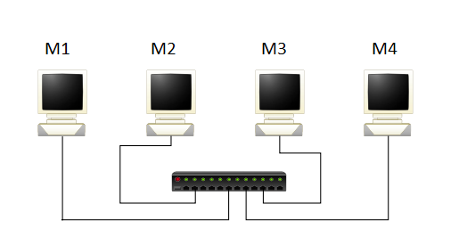
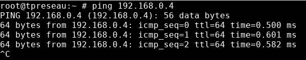
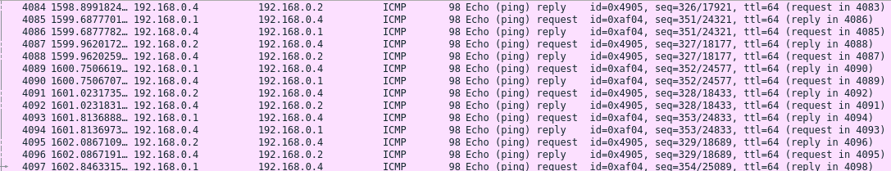
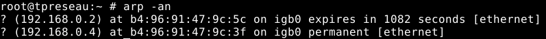

# Choix des adresses

Nous avons choisi 192.168.0.0/24 (classe C) comme adresse pour le réseau. Nous avons également fait le choix de réserver les 24 premiers bits pour identifier le réseau comme nous savions que nous allions pas utiliser beaucoup de machines. De ce fait,
nous avons décidé d’allouer 8 bits (1 octet) pour la partie machine à l’aide du masque, qui nous permet de délimiter la partie réseau et la partie machine.

Les adresses des différentes machines sont les 
suivantes:

- M1: 192.168.0.1/24
- M2: 192.168.0.2/24
- M3: 192.168.0.3/24
- M4: 192.168.0.4/24

L’interface utilisée est bge0 qui permet de détecter les collisions.

# Configuration des interfaces

**Netmask**: 0xffffff00 -> 255.255.255.0

Cela permet de nous indiquer quels octets définissent lapartie réseau et ceux qui sont destinés à identifier la machine.

**Adresses de Broadcast**: 192.168.0.255

Cela permet de nous indiquer quelle est l’adresse maximale du réseau, nous avons donc des adresses comprises entre la plage 192.168.0.1 et 192.168.0.254 inclues, ce qui signifie que le nombre d’adresse IP pour ce réseau est de 255.

# Commande ping

La commande ping permet d’envoyer à intervalle régulier des paquets à la machine de destination, puis cette machine envoie une réponse ping toujours sous forme de ping. Cette commande permet de voir si deux machines sont bien connectées entre elles sur un réseau.

# Paquets ARP

La commande ping permet d’émettre des paquets de type ARP vers une adresse de destination qui n’a pas encore été utilisé. Dans ce cas-là, elle sera alors ajoutée dans ce que l’on appelle la table ARP, qui permet de stocker les résolutions MAC-IP par les ordinateurs, serveurs et éléments actifs du réseau, elle permet d’accélérer les échanges.  La table ARP ne conserve pas ces adresses vers les autres machines du réseau indéfiniment, elles sont effacées au bout d’un certain temps pour ne pas encombrer la mémoire inutilement

# Nombre de collisions

Avec la commande **netstat**, entre les machines M1 et M2, le nombre de collisions et d’erreurs sont nuls. On peut expliquer cela par le flux de données dans notre réseau qui va de la machine M1 à M2

# Variation du nombre de collisions

Nous effectuons la commande **udpmt** entre les machines M3 et M4 pour observer les collisions, après 1 minute, le nombre de collisions en moyenne est de 800 collisions toutes les 10 secondes. On peut expliquer cette augmentation, par les deux trafics que nous effectuons en simultanée. Le protocole CSMA/CD permet donc de limiter le nombre de collisions.

# Observation des paquets

# Calcul de Tprop

La formule pour calculer Tprop est: $Tprop = L / V$

L = la taille du câble ETHERNET

V= Vitesse de l’onde dans le câble

Dans notre cas L vaut 1,5 mètres et V vaut $2*10^(8) m/s$

On a donc: $Tprop = 7,5*10^-9s$

On peut donc calculer l’efficacité:

# Débits

# Analyse courbe évolution du débit

# Débit applicatif

# Comparaison débit

# Mesure de la latence

