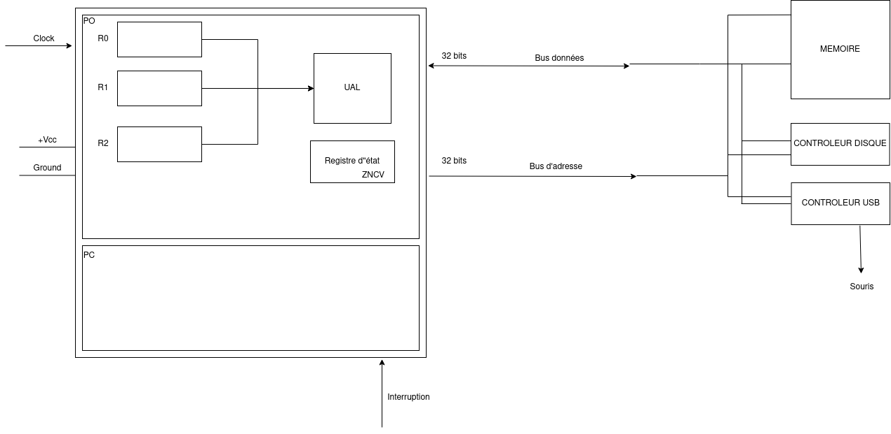

_25/01_

## ALM1 : Le retour

```c
while(1){
	...
}
```
Egal à : (en ARM)

```asm
inst <- mem[PC]
execute(inst)
PC++
inter?
	- oui -> ...
	- non -> retourne premiere ligne
```



\newpage

## Programme

- Les principes des Systèmes d'Exploitation
- Les excpetions / interruptions
- La mémoire virtuelle / MMU (Memory managment unit)
- Caches
- Pipeline / super scalaire / ...

# Introduction aux Systèmes d'Exploitations

## Utilisé d'un SE

Widows 3.1 premiers à faire du "multitache" mais boucle sans fin vraiment sans fin. Windows 95 vrai premier OS.    
Unix est une norme, un OS est un OS s'il respecte la norme (Linux n'est pas formellement un UNIX).

- multi-tâche
- abstraction du matériel
	- File System
	- TCP, IP / socket
	- processus
		- processeur
		- mémoire
- sécutité / arbitrage
 	- 2 modes du processeur
 	- restriction d'accès mémoire
